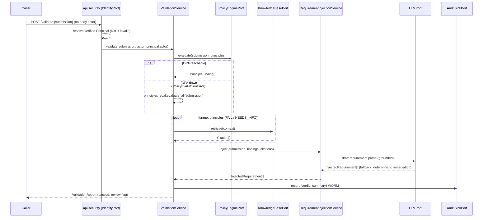
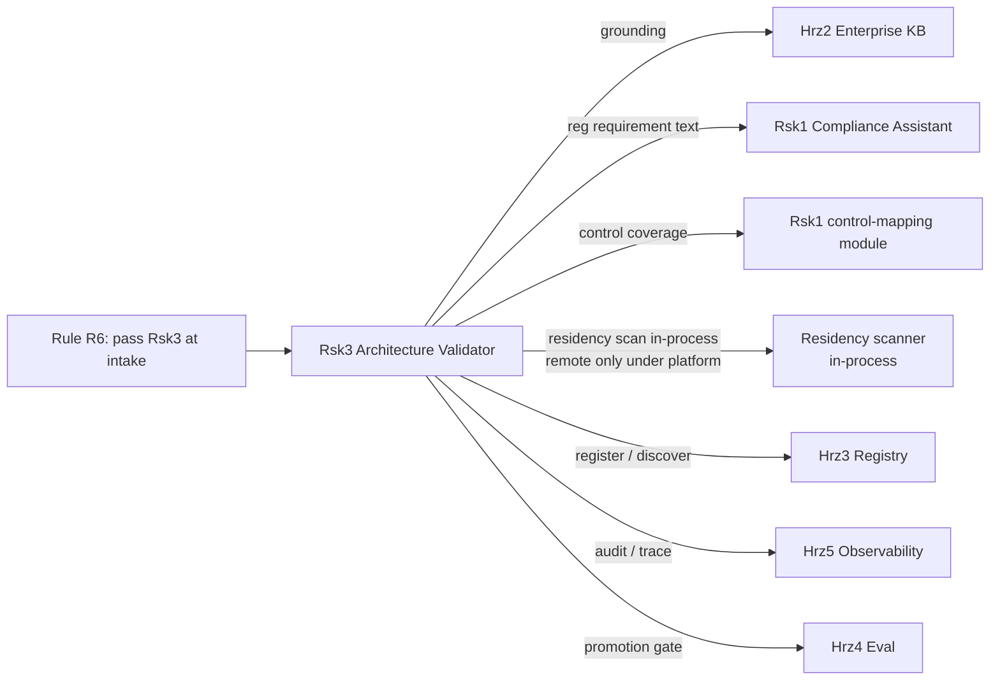

# ARCHITECTURE: Rsk3 Architecture, Requirements & Residency Validator

Documentation authority is declared in [`docs/doc-authority.md`](docs/doc-authority.md).

Hexagonal ports-and-adapters. The domain core is pure standard library and depends only on
ports (`@runtime_checkable` Protocols); adapters provide four interchangeable families
(`gcp`, `local`, `platform`, `onprem`) behind each port, selected by the active profile.
The `local` family is a WORKING offline stack (SDK-free, deterministic, seedable); the
`onprem` family is the fail-fast migration target.

The residency-scan service is a second pure-stdlib domain that lives behind the same hexagon
and shares this service, its profile switch, and its wiring layers. The architecture below
covers both the design-time validation pipeline and the residency-scan pipeline.

## Ports

| Port | Method(s) | gcp primary | local (offline) | platform | onprem |
| --- | --- | --- | --- | --- | --- |
| `PolicyEnginePort` | `evaluate(submission, principles)` | OPA REST on Cloud Run | in-process principle evaluator | (same OPA client) | fail-fast stub |
| `KnowledgeBasePort` | `retrieve(query, top_k)` | File Search | SQLite FTS5 reg-KB | Rsk1 `/ask` client | fail-fast stub |
| `ControlMappingClientPort` | `coverage(scope)` | Rsk2 client | in-process canned | Rsk2 client | fail-fast stub |
| `ResidencyClientPort` | `findings(scope)` | in-process scan service | in-process scan service | remote scanner (`RSK_RESIDENCY_URL`) | fail-fast stub |
| `LLMPort` | `generate`, `classify` | Gemini (google-genai) | deterministic schema-driven | n/a | fail-fast stub |
| `AuditSinkPort` | `record(event)` | Cloud Logging WORM | append-only SQLite | Hrz5 client | fail-fast stub |
| `ObservabilityTracerPort` | `span`, `record_token_usage` | Cloud Trace (OTel) | no-op | n/a | no-op |
| `EvaluationGatePort` | `evaluate(dataset_path)` | Gen AI eval service | in-repo offline gate | n/a | fail-fast stub |
| `AgentRegistryPort` | `register`, `get`, `list` | in-proc A2A registry | in-process (Firestore emulator opt-in) | Hrz3 client | fail-fast stub |
| `ToolCatalogPort` | `list_tools`, `get_tool` | MCP catalog | in-process | n/a | fail-fast stub |
| `IdentityPort` | `resolve(ctx)` | verify IAP assertion | seeded dev personas (no IdP) | (same IAP adapter) | fail-fast stub |

`control_mapping` and `residency` are consumed best-effort: a failure degrades a finding's
context rather than aborting the validation. `residency` is served IN-PROCESS by default
(`LocalScanResidencyAdapter` calls the residency scan service, no network hop); the
`platform` profile alone binds the `RemoteResidencyAdapter` (`RSK_RESIDENCY_URL`) for a
split deployment.

`IdentityPort` resolves the verified end-user `Principal` server-side from the inbound
request headers; the request body carries no `actor`. See
[`docs/embedding-and-identity.md`](docs/embedding-and-identity.md).

## Residency-scan sub-domain

The residency scanner is its own pure-stdlib domain (`ResidencyScanService` +
the deterministic `ViolationDetector` + the `compute_verdict` gate + the `ResidencyPolicy`)
behind its own ports. It exposes `POST /scan` and `GET /policy` on the same service, and the
`architecture-validator scan` / `architecture-validator policy` subcommands plus the preserved
`residency-validator scan` CI-gate console script drive it.

| Port | Method(s) | gcp | local (offline) | platform | onprem |
| --- | --- | --- | --- | --- | --- |
| `IaCScannerPort` | `scan(scope)` | Cloud Asset Inventory + SCC | seeded in-process estate | n/a | fail-fast stub |
| `LLMPort` (scan) | `generate` remediation prose | Gemini | deterministic schema-driven | n/a | fail-fast stub |
| `AuditSinkPort` | `record(event)` | Cloud Logging WORM | append-only SQLite | Hrz5 client | fail-fast stub |

The deterministic detection path (parse -> detect -> verdict) uses **no port**: it is pure
domain plus the `architecture_validator.pipelines.terraform` parser (stdlib `json` + `re`), which is
why the `residency-validator scan --plan|--dir` CI gate runs SDK-free under any profile. The
scanner resolves a live `--project` scope through `IaCScannerPort`; the LLM only drafts
remediation prose and never flips a verdict. Detector rules flag `REGION_NOT_ALLOWED` /
`GLOBAL_ENDPOINT` / `UNKNOWN_REGION` (P-03), `MISSING_CMEK` (P-09 / P-10), and
`PUBLIC_EGRESS` / `RESIDENCY_CONTROL_MISSING` (P-01), each citing the breached principle and
the in-country regulator (MAS / HKMA / APRA / FSA).

### Two decision enums, one audit record

The domain now carries two distinct decision vocabularies that must not be conflated:
`Decision` for architecture validation (`ALLOWED` / `BLOCKED` / `ESCALATED`) and
`ResidencyDecision` for a scan (`PASSED` / `FAILED` / `ESCALATED`). The unified audit record
carries the architecture `Decision`, with the scan-native value preserved in
`metadata["scan_decision"]`, so a residency scan is auditable in the same WORM record shape
without losing its native verdict.

## Topology

```mermaid
flowchart TB
  subgraph Clients
    UI[Next.js console]
    CLI[architecture-validator CLI]
    PEER[A2A peer / Agent Runtime]
  end
  UI & CLI & PEER --> API[FastAPI app.py]
  API --> DEPS[deps.py / Container]
  DEPS --> VS[ValidationService]
  DEPS --> IS[RequirementInjectionService]
  VS --> PE[PolicyEnginePort]
  VS --> KB[KnowledgeBasePort]
  VS --> Rsk2[ControlMappingClientPort]
  VS --> Rsk4[ResidencyClientPort]
  VS --> AU[AuditSinkPort]
  VS --> TR[ObservabilityTracerPort]
  IS --> LLM[LLMPort]
  PE -.gcp.-> OPA[(OPA on Cloud Run<br/>rego bundle)]
  PE -.local.-> EVAL[(in-process<br/>principle evaluator)]
  PE -.onprem.-> STUB1[[NotImplemented]]
  KB -.gcp.-> FS[(File Search)]
  KB -.local.-> FTS[(SQLite FTS5<br/>reg-KB)]
  KB -.platform.-> Rsk1[(Rsk1 /ask)]
  AU -.gcp.-> WORM[(Cloud Logging WORM)]
  AU -.local.-> SQL[(append-only SQLite)]
  LLM -.gcp.-> GEM[(Gemini 3.5 Flash)]
  LLM -.local.-> DET[(deterministic<br/>schema-driven)]
```

## Validation sequence

## Dependency relationship (catalog)

Rsk3 is the enforcer the other systems defer to: it operationalises every General Principle
as a check, and is the "enforced by" target for P-02 and P-05 and the gate for R6. It has
**no Hrz1 Guardrail dependency**: it processes project metadata, not customer PII.

## Deploy-time residency (Terraform reconciliation)

One Terraform stack covers the validator and the residency scanner together. The org policy
uses `google_org_policy_policy` rather than the older `google_project_organization_policy`,
with a 4-constraint set (`resource_locations`, `no_external_ip`, `uniform_bucket_access`,
`restrict_cmek_projects`). A Cloud Asset Inventory feed (`cloud_asset_inventory.tf`) and an
`agent_runtime` service account serve the live-scan path. The OPA Cloud Run sidecar (port
8181) evaluates the rego bundle. Region stays pinned to `asia-southeast1` with a fail-fast
validation, and the org policy resource-location allowlist must stay in lockstep with the
residency policy's `allowed_regions` (the policy prevents, the scanner detects).

## Profile switch

`ARCH_VALIDATOR_PROFILE` rebinds every port with no change to the domain:

- `local` binds the WORKING offline family: the whole intake pipeline runs with no Google
  Cloud, no API key and no emulators (SQLite FTS5 reg-KB, deterministic LLM, in-process
  policy evaluator, append-only SQLite audit). This is the dev/test/CI default. Optional
  Google emulators (for example `FIRESTORE_EMULATOR_HOST`) are auto-detected and opt-in;
  the google client is imported lazily, only on that branch.
- `onprem` binds the fail-fast placeholder family: every method raises
  `NotImplementedError`, so a primary CLI command exits 2 with the migration message.

The contract test proves both families construct with a single `Settings` and structurally
satisfy their Protocols (local additionally returns real, page-cited context offline) -
the demonstrable no-lock-in property (P-02).
