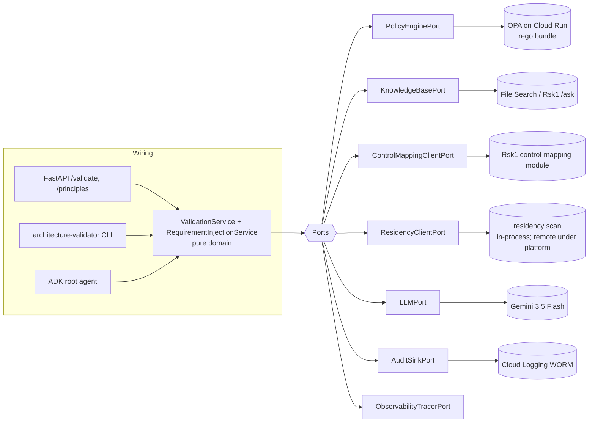
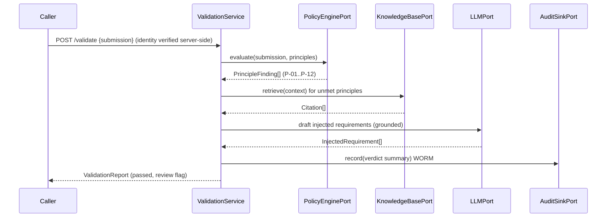

# Rsk3 · Architecture, Requirements & Residency Validator

Documentation authority is declared in [`docs/doc-authority.md`](docs/doc-authority.md).

**Industries:** All GenAI / cloud; especially regulated industries

The **policy-as-code gate at project intake** for an APAC bank's agentic-AI platform.
Rsk3 validates a project's requirements and design against the **12 General Principles**
(P-01..P-12) expressed as policy-as-code, cross-checks the regulatory knowledge base,
and **auto-injects the missing non-functional requirements** so a project cannot start
non-compliant. It is the system rule **R6** points to ("any new project SHOULD pass Rsk3
at intake"): the enforcer the other systems defer to.

It also carries an in-repo **residency / IaC scanner**, so one gate covers both the design
and the cloud posture. Given a
Terraform plan JSON (`terraform show -json`), a directory of `.tf` files, or a live GCP scope
(Cloud Asset Inventory + SCC), the scanner emits a PASS/FAIL `ResidencyScan` over region and
residency violations (disallowed region, global / multi-region endpoint, missing regional
CMEK, public egress, no VPC-SC perimeter). The file-based scan is pure stdlib and exits
non-zero on FAIL, so it drops into a pipeline as a CI gate; the same scan is what `/validate`
consults in-process for residency context.

Built ports-and-adapters (hexagonal) on the **Gemini Enterprise Agent Platform**, region
pinned to `asia-southeast1` (Singapore) for data residency. The domain core is pure
standard library and runs the full validation pipeline **offline with no Google Cloud SDK
installed** (the on-prem / test profile).

- **Catalog identity:** Rsk3 · group `rsk` · priority P2 · buyer Architecture Review Board / Risk (also owns the residency / IaC scanner)
- **Package:** `architecture_validator` · **CLI:** `architecture-validator` (`validate`, `scan`, `policy`, `principles`, ...) · the `residency-validator scan` console script is the CI-gate entry point · **Service port:** 8088
- **Profile env var:** `ARCH_VALIDATOR_PROFILE` (`gcp` | `local` | `platform` | `onprem`; dev/tests/CI use `local`). `RESIDENCY_VALIDATOR_*` variables are not read.

## What it produces (cited artifacts)

**Validation** produces three artifacts; the **residency scan** produces a fourth.

1. **ValidationReport**: the overall verdict for a `ProjectSubmission` (PASS only if no
   principle FAILs), the per-principle findings, and the injected requirements. Always
   `requires_human_review=True` when any FAIL or HIGH/CRITICAL finding is present.
2. **PrincipleFinding[]**: one per principle: `principle_id`, `status`
   (PASS | FAIL | NEEDS_INFO | NOT_APPLICABLE), the `rule_id` that checked it, the
   `evidence` in the submission that drove the verdict, `severity`, `remediation`, and
   `citations` (to the principle and/or the reg KB).
3. **InjectedRequirement[]**: the missing non-functional requirements auto-injected at
   intake (e.g. "Pin all data + processing to `asia-southeast1` (P-03)", "Place
   managed-service APIs inside a VPC-SC perimeter; no public egress (P-01)"), each tied to
   the principle that mandates it, with rationale, severity and citations.
4. **ResidencyScan** (residency capability): the full result for an IaC / config target:
   `resources_scanned`, the PASS/FAIL `ScanVerdict` (with per-severity counts and the CI
   exit code), and `ResidencyViolation[]` (per offending resource: address, type, kind,
   found_region, allowed_regions, severity, `rule_id`, remediation, evidence, and citations
   to P-01 / P-03 / P-10 and the in-country regulator).

## Architecture (ports & adapters)



The domain depends only on **ports** (`@runtime_checkable` Protocols). Adapters come in
four families behind each port:

- **`gcp/`**: managed-service adapters (OPA REST, File Search, Gemini, Cloud Logging,
  Cloud Trace, Gen AI eval, A2A registry, MCP catalog). All `google-*` imports are lazy.
- **`local/`**: a WORKING offline laptop stack: SQLite **FTS5** reg-KB, a deterministic
  schema-driven LLM, the in-process principle evaluator as the policy engine, an
  append-only SQLite audit, no-op tracer, and in-process Rsk2/Rsk4/registry/catalog. Runs the
  whole pipeline with **no Google Cloud, no API key and no emulators by default**; imports
  no `google-cloud` package on the default path.
- **`platform/`**: thin `httpx` clients to sibling services (Rsk1 `/ask` and, from Rsk1's
  control-mapping module, `/evidence-pack`; Rsk4 `/scan`, Hrz3 registry, Hrz5
  observability).
- **`onprem/`**: fail-fast placeholder migration targets: construct cleanly with a single
  `Settings`, satisfy the same Protocol, and raise `NotImplementedError` from each method.

Switching the whole stack is a one-line change of `profile`; the domain never changes
(P-02, no vendor lock-in). The contract test proves both the `local` (working) and
`onprem` (fail-fast) families are interface-parity with the managed stack.

## The validation pipeline



An OPA outage falls back to the in-process deterministic evaluator
(`domain/principles_eval.py`), so a verdict is always produced (P-10).

## Quickstart (offline, no Google Cloud SDK)

```bash
python3.12 -m venv .venv && . .venv/bin/activate
pip install -e ".[dev]"

ruff check src tests
ruff format --check src tests
pytest -m 'not integration' -q       # unit + contract, on the local profile
python eval/run_eval.py              # the Hrz4 / P-08 offline eval gate
```

The managed stack installs with `pip install -e ".[gcp,dev]"` and runs under
`ARCH_VALIDATOR_PROFILE=gcp`.

## Run locally (the `local` profile, end to end, offline)

The `local` profile runs the full intake pipeline with no Google Cloud, no API key and no
emulators. The reg-KB self-seeds a tiny synthetic corpus into a SQLite FTS5 index on first
use, so a validation grounds its findings out of the box:

```bash
export ARCH_VALIDATOR_PROFILE=local
architecture-validator validate eval/datasets/sample_submission.json
```

This produces a real `ValidationReport`: a FAIL verdict over the 12 principles with one
injected requirement per unmet principle, each cited to its principle (exit code 0). Run
the same command under `ARCH_VALIDATOR_PROFILE=onprem` and the CLI exits **2** with the
migration message, because the on-prem family is fail-fast by design.

Optional higher-fidelity local: set a Google emulator host (for example
`FIRESTORE_EMULATOR_HOST=localhost:8080`) **and** install the `[gcp]` extra to route the
in-process registry to the Firestore emulator. The google client is imported lazily, only
on that branch, so the default `local` path stays SDK-free.

## HTTP surface

| Method | Path | Body | Returns |
| --- | --- | --- | --- |
| POST | `/validate` | `{submission:{...}}` | `ValidationReport` |
| GET | `/principles` | n/a | the 12 `Principle` objects |
| POST | `/scan` | `{target\|plan_json\|resources}` | `ResidencyScan` (residency capability) |
| GET | `/policy` | n/a | the active `ResidencyPolicy` |
| GET | `/healthz` | n/a | profile + region |
| GET | `/v1/personas` | n/a | seeded dev personas (local profile only; else `[]`) |
| GET | `/.well-known/agent-card.json` | n/a | A2A AgentCard |

The request body carries no `actor`: identity is verified server-side by the active
profile's `IdentityPort` (seeded personas via `X-Dev-Persona` in `local`, an IAP-injected
assertion in `gcp`), and the verified subject is the audit actor. See
[`docs/embedding-and-identity.md`](docs/embedding-and-identity.md).

AgentCard skills: `validate_project`, `inject_requirements`, `list_principles` (validation)
plus `scan_iac`, `scan_project`, `explain_violation` (residency scan).

## Repository layout

```
src/architecture_validator/
  domain/        pure-stdlib models, principles, deterministic evaluator, services
  ports/         @runtime_checkable Protocols (the hexagon boundary)
  adapters/      gcp/ · local/ (offline) · platform/ · onprem/ (fail-fast)
  policies/      principles.yaml + *.rego (the policy-as-code bundle)
  pipelines/     terraform.py: pure-stdlib plan / .tf parser for the residency CI gate
  api/  cli/  agent/   import-safe wiring layers (heavy imports lazy)
eval/            offline heuristic gate + rubrics + golden datasets
infra/terraform/ asia-southeast1 resources (OPA on Cloud Run, KMS, WORM, VPC-SC, ...)
ui/              Next.js console rendering the validation report (source only)
```

See `SPEC.md` (authoritative build spec), `ARCHITECTURE.md` (ports table, topology),
`COMPLIANCE.md` (P-01..P-12 + R1..R6 mapping), and `CONTRIBUTING.md`.

## Cost and latency

Size this system's cost and latency with the shared interactive calculator: [**live**](https://portable-genai.github.io/cost-latency-calculator/calc/calculator.html?system=Rsk3) or the [in-repo page](cost-latency-calculator.html). The engine and the pricing book are maintained once in [cost-latency-calculator](https://github.com/portable-genai/cost-latency-calculator).

## License

Apache-2.0. See `LICENSE`. The regulatory text in fixtures and the golden datasets is
fictional and must not be treated as the real instruments.
